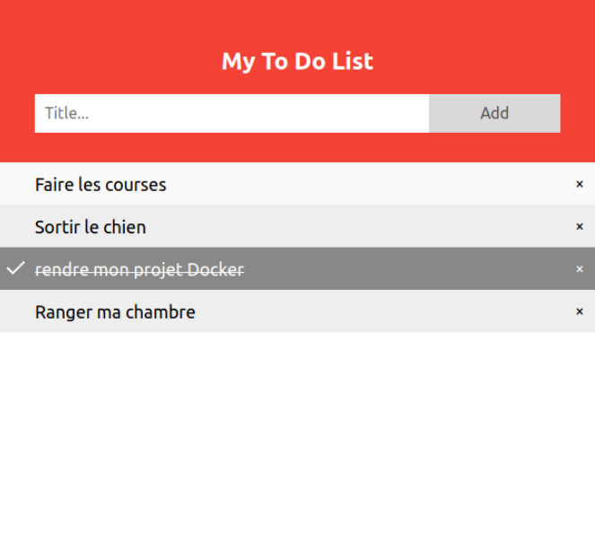

# TodoList

L'objectif de ce projet était de mettre en pratique les connaissances acquises durant une formation Docker.



### Technos :

- Docker

- Express

- React

### Descriptif :

On va retrouver 2 containers : "api-server" et "front-server".

Respectivement ces conteneurs contiendront les images "api" et "front".

L'image "api" contiendra notre API en Express et l'image "front" contiendra notre application React.

Nous avons donc nos deux containers qui sont capables de discuter entre eux.

Ainsi notre application React peut discuter avec notre API Express qui elle va discuter avec nos données.

Pour obtenir ce set-up nous aurons un fichier :


Celui-ci va permettre de déclarer la configuration voulue pour notre projet :

```yml
version: "3.8"

services:
  api-server:
    image: api
    build: Back
    env_file: 
      - .env
    ports:
      - "8080:8080"
    volumes:
      - "./Back/Todolist.json:${APP}/Todolist.json"
  front-server:
    image: front
    build: Front
    ports: 
      - "3000:3000"
    depends_on:
      - api-server
```

Nos images sont construites via des Dockerfile issues des Dossier Back et Front.

Afin que les données soient persistées, nous avons un volume pour notre application Express.
